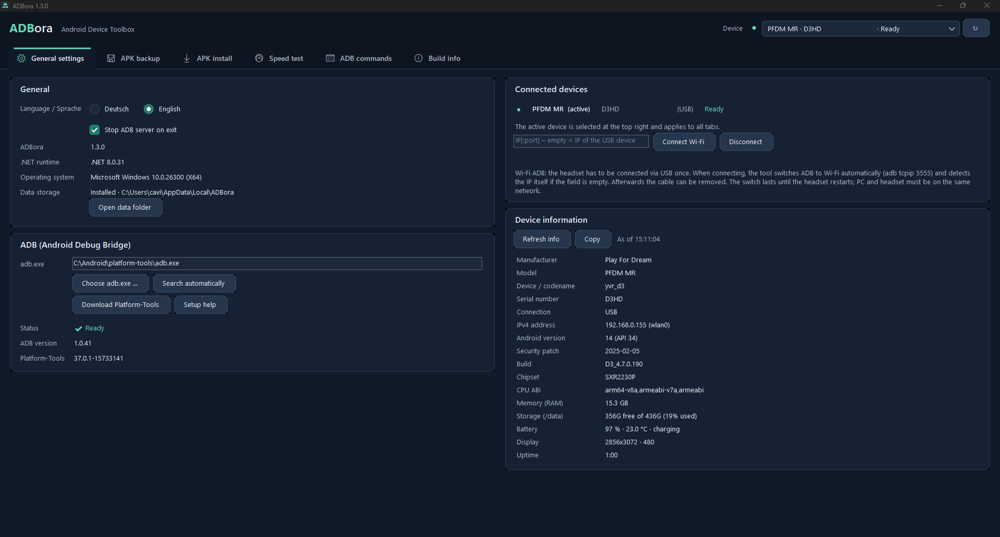

# ADBora – Android Device Toolbox

**[Deutsch](#deutsch) · [English](#english)**

---



## Deutsch

**ADBora** ist eine native Windows-Anwendung (.NET 8 WinForms, dunkles Theme), die das
**APK Backup Tool** und den **ADB USB Speed Test** in einem Programm vereint –
ergänzt um APK-Installation, WLAN-ADB und eine ADB-Konsole mit gespeicherten Befehlen.
Oberfläche umschaltbar zwischen Deutsch und Englisch. Kein Python und keine
separate .NET-Laufzeit nötig (self-contained).

### Download-Varianten

| Variante | Datei | Einstellungen & Cache |
|---|---|---|
| **Portabel** | `ADBora-Portable-<Version>-Windows-x64.zip` entpacken, `ADBora.exe` starten | Ordner `Data` neben der EXE (erkennbar an `portable.flag`) – nichts wird ausserhalb des Ordners gespeichert |
| **Installer** | `ADBora-Setup-<Version>.exe` | `%LOCALAPPDATA%\ADBora`; Startmenü-Eintrag, optional Desktop-Symbol, sauberer Deinstaller unter „Apps“ |

Der Installer kann ohne Administratorrechte (nur für den aktuellen Benutzer)
oder für alle Benutzer installieren. Beim **Deinstallieren** wird gefragt, ob
die Nutzerdaten (Einstellungen, gespeicherte Befehle, Metadaten-Cache) ebenfalls
gelöscht werden sollen. APK-Backups werden nie gelöscht.
Die aktuelle Datenablage steht im Tab „Allgemeine Einstellungen“ → „Datenablage“.

### Tabs

| Tab | Inhalt |
|---|---|
| **1 · Allgemeine Einstellungen** | Sprache, ADB einrichten (adb.exe wählen, automatisch suchen, Platform-Tools-Download, Einrichtungshilfe), Versionen (ADBora, ADB, Platform-Tools, .NET, Windows), Datenablage, angeschlossene Geräte, WLAN-ADB, Geräteinformationen (Hersteller, Modell, IPv4-Adresse, Android-Version, Sicherheitspatch, Chipsatz, RAM, Speicher, Akku, Display, Laufzeit) |
| **2 · APK Backup** | Nachinstallierte Apps einlesen (Name, Version, Icon direkt aus der APK), APK / OBB / Android/data sichern – inkl. Split-APKs, SHA-256-Prüfsummen, `manifest.json`, `backup-report.json`, `INSTALL.txt`; einzelne Apps per Papierkorb-Symbol **deinstallieren** |
| **3 · APK Install** | APK per Drag & Drop installieren (Split-APKs werden erkannt), App-Ordner aus einem Backup inkl. OBB, OBB-Ordner nach `/sdcard/Android/obb/<Paket>` kopieren, Gerät (MTP) im Explorer öffnen |
| **4 · Speedtest** | ADB-Durchsatztest über USB oder WLAN: maximale stabile Transferrate (automatische Reduktion bei Abbrüchen) oder feste Bandbreite; Live-Werte und Verlauf |
| **5 · ADB Commands** | ADB-Befehle mit Live-Ausgabe, Stopp, Verlauf (↑/↓) und eigenen gespeicherten Befehlen |

Das **aktive Gerät** wird oben rechts gewählt und gilt für alle Tabs (mehrere
Geräte werden unterstützt, ADB-Aufrufe laufen mit `-s <Seriennummer>`). Es läuft
immer nur ein ADB-Vorgang gleichzeitig.

### ADB / Android Platform Tools

ADB ist nicht enthalten. Gesucht wird in: gespeicherter Pfad, `adb\adb.exe` bzw.
`platform-tools\adb.exe` neben der EXE, `PATH`, `ANDROID_SDK_ROOT` / `ANDROID_HOME`,
`%LOCALAPPDATA%\Android\Sdk\platform-tools`, `C:\Android\platform-tools`.
Fehlt ADB, öffnet sich die Einrichtungshilfe.
Download: https://developer.android.com/tools/releases/platform-tools

### APK Backup

| Komponente | Quelle auf Android | Ziel im App-Ordner |
|---|---|---|
| APK | alle von `pm path` gemeldeten APKs | `APK/App-Name-Version.apk` bzw. Basis + Splits |
| OBB | `/sdcard/Android/obb/<Paket>` | `OBB/` |
| Daten | `/sdcard/Android/data/<Paket>` | `Data/` |

Private Daten unter `/data/data` (Logins, interne Datenbanken, viele Spielstände)
sind **nicht** enthalten; es werden keine Root-Rechte verwendet. Verweigert ein
Gerät `adb pull`, wird `adb exec-out cat` verwendet. Jede APK wird erst nach
Grössen-, ZIP- und (falls verfügbar) SHA-256-Prüfung übernommen. App-Name,
Version und Icon werden im Metadaten-Cache gespeichert (nur Metadaten).

**Deinstallieren:** Papierkorb-Symbol am Zeilenende → Bestätigung →
`adb uninstall <Paket>`. App und App-Daten werden vom Gerät entfernt.

```text
Speicherort/
  Backup_2026-09-30_11-42-58_21264b/
    App-Name [com.example]/
      APK/  OBB/  Data/
      INSTALL.txt
      manifest.json
    backup-report.json
```

### APK Install

- **APK:** eine oder mehrere `.apk` hineinziehen. Mehrere APKs desselben Pakets
  werden als Split-App installiert (`adb install-multiple -r`), sonst einzeln
  (`adb install -r`). Optional `-d` (Downgrade) und `-g` (Berechtigungen).
- **Backup-Ordner:** App-Ordner `Name [Paket]` hineinziehen – installiert `APK/`
  und kopiert `OBB/`.
- **OBB:** Ordner hineinziehen; Paketname aus Ordnername, Backup-Ordner,
  `manifest.json` oder `main.<Version>.<Paket>.obb`, sonst Nachfrage.
- **Explorer:** öffnet das Gerät unter „Dieser PC“ (MTP), sonst „Dieser PC“.

### WLAN-ADB

1. Headset einmal per USB anschliessen (Status „Bereit“).
2. Feld leer lassen (oder `IP[:Port]` eingeben) und **WLAN verbinden** klicken.
3. Klappt die direkte Verbindung nicht, schaltet das Tool ADB auf dem USB-Gerät
   auf WLAN um (`adb tcpip 5555`), ermittelt die IP und verbindet. Danach kann
   das Kabel ab; das WLAN-Gerät wird aktives Gerät.

Gilt bis zum nächsten Neustart des Headsets. PC und Headset müssen im selben
Netz sein (kein Gäste-WLAN / keine Client-Isolation).

### Speedtest – Messprinzip

```text
PC-TCP-Sender → adb reverse → USB/WLAN → toybox nc (Gerät) → /dev/null
```

Es wird nichts auf dem Gerät gespeichert. Der Wert ist der Durchsatz dieses
ADB/TCP-Pfads, nicht die theoretische Busgeschwindigkeit.

### ADB Commands

- Präfix `adb` ist optional. Bei `shell …` geht der Rest der Zeile unverändert an
  die Geräte-Shell (Pipes/Anführungszeichen, z. B. `shell dumpsys battery | grep level`).
- „An aktives Gerät senden (-s)“ ergänzt `-s <Seriennummer>` (nicht bei `devices`, `version`, `connect` …).
- Dauerläufer wie `logcat` mit **Stopp** beenden.
- Eigene Befehle: eingeben → **Aktuellen Befehl speichern …** → Name vergeben.

### Build

Voraussetzung (nur Build-PC): .NET 8 SDK, für den Installer zusätzlich
[Inno Setup 6](https://jrsoftware.org/isdl.php).

```text
build\BUILD.cmd
```

Ergebnis in `dist\`: `ADBora-Portable\`, `ADBora-Portable-<Version>-Windows-x64.zip`
und – falls Inno Setup installiert ist – `ADBora-Setup-<Version>.exe`.
Optional Platform-Tools nach `build\adb\` kopieren, dann werden sie mitgeliefert.
Diagnose: `ADBora.exe --check-apk <datei.apk>`.

### Lizenz

GPL-3.0 (siehe `LICENSE`). Android Debug Bridge / Platform Tools sind separate
Google-Komponenten und nicht Teil dieses Projekts. Erstellt von
[@urscaviezel](https://github.com/urscaviezel).

---

## English

**ADBora** is a native Windows application (.NET 8 WinForms, dark theme) that combines the
**APK Backup Tool** and the **ADB USB Speed Test** in one program – extended with
APK installation, Wi-Fi ADB and an ADB console with saved commands. The UI can
be switched between German and English. No Python and no separate .NET runtime
required (self-contained).

### Download variants

| Variant | File | Settings & cache |
|---|---|---|
| **Portable** | extract `ADBora-Portable-<version>-Windows-x64.zip`, run `ADBora.exe` | `Data` folder next to the EXE (marked by `portable.flag`) – nothing is stored outside the folder |
| **Installer** | `ADBora-Setup-<version>.exe` | `%LOCALAPPDATA%\ADBora`; Start menu entry, optional desktop icon, clean uninstaller in "Apps" |

The installer can install without administrator rights (current user only) or
for all users. When **uninstalling**, you are asked whether the user data
(settings, saved commands, metadata cache) should be deleted as well. APK
backups are never deleted. The current data location is shown in
"General settings" → "Data storage".

### Tabs

| Tab | Content |
|---|---|
| **1 · General settings** | Language, ADB setup (choose adb.exe, auto search, Platform-Tools download, setup help), versions (ADBora, ADB, Platform-Tools, .NET, Windows), data storage, connected devices, Wi-Fi ADB, device information (manufacturer, model, IPv4 address, Android version, security patch, chipset, RAM, storage, battery, display, uptime) |
| **2 · APK backup** | Scan user-installed apps (name, version, icon read from the APK), back up APK / OBB / Android/data – incl. split APKs, SHA-256 checksums, `manifest.json`, `backup-report.json`, `INSTALL.txt`; **uninstall** single apps via the trash icon |
| **3 · APK install** | Install APKs via drag & drop (split APKs detected), app folders from a backup incl. OBB, copy OBB folders to `/sdcard/Android/obb/<package>`, open the device (MTP) in Explorer |
| **4 · Speed test** | ADB throughput test via USB or Wi-Fi: maximum stable transfer rate (automatic reduction on disconnects) or fixed bandwidth; live values and history |
| **5 · ADB commands** | ADB commands with live output, stop, history (↑/↓) and your own saved commands |

The **active device** is selected at the top right and applies to all tabs
(several devices supported, ADB calls use `-s <serial>`). Only one ADB operation
runs at a time.

### ADB / Android Platform Tools

ADB is not included. Search order: saved path, `adb\adb.exe` or
`platform-tools\adb.exe` next to the EXE, `PATH`, `ANDROID_SDK_ROOT` / `ANDROID_HOME`,
`%LOCALAPPDATA%\Android\Sdk\platform-tools`, `C:\Android\platform-tools`.
If ADB is missing, the setup help opens.
Download: https://developer.android.com/tools/releases/platform-tools

### APK backup

| Component | Source on Android | Target in the app folder |
|---|---|---|
| APK | all APKs reported by `pm path` | `APK/App-Name-Version.apk` or base + splits |
| OBB | `/sdcard/Android/obb/<package>` | `OBB/` |
| Data | `/sdcard/Android/data/<package>` | `Data/` |

Private data in `/data/data` (logins, internal databases, many save games) is
**not** included; no root access is used. If a device refuses `adb pull`,
`adb exec-out cat` is used. Every APK is only kept after size, ZIP and (if
available) SHA-256 verification. App name, version and icon are stored in the
metadata cache (metadata only).

**Uninstall:** trash icon at the end of the row → confirmation →
`adb uninstall <package>`. The app and its data are removed from the device.

### APK install

- **APK:** drop one or more `.apk` files. Several APKs of the same package are
  installed together as a split app (`adb install-multiple -r`), otherwise one
  by one (`adb install -r`). Optional `-d` (downgrade) and `-g` (permissions).
- **Backup folder:** drop an app folder `Name [package]` – installs `APK/` and copies `OBB/`.
- **OBB:** drop a folder; package name from the folder name, backup folder,
  `manifest.json` or `main.<version>.<package>.obb`, otherwise you are asked.
- **Explorer:** opens the device under "This PC" (MTP), otherwise "This PC".

### Wi-Fi ADB

1. Connect the headset via USB once (status "Ready").
2. Leave the field empty (or enter `IP[:port]`) and click **Connect Wi-Fi**.
3. If a direct connection fails, the tool switches ADB on the USB device to
   Wi-Fi (`adb tcpip 5555`), detects the IP and connects. Afterwards the cable
   can be removed; the Wi-Fi device becomes the active device.

Valid until the headset restarts. PC and headset must be on the same network
(no guest Wi-Fi / client isolation).

### Speed test – how it works

```text
PC TCP sender → adb reverse → USB/Wi-Fi → toybox nc (device) → /dev/null
```

Nothing is written to the device. The value is the throughput of this ADB/TCP
path, not the theoretical bus speed.

### ADB commands

- The `adb` prefix is optional. With `shell …` the rest of the line is passed
  unchanged to the device shell (pipes/quotes, e.g. `shell dumpsys battery | grep level`).
- "Send to active device (-s)" adds `-s <serial>` (not for `devices`, `version`, `connect` …).
- Stop long-running commands such as `logcat` with **Stop**.
- Own commands: type → **Save current command …** → enter a name.

### Build

Requirements (build PC only): .NET 8 SDK, for the installer additionally
[Inno Setup 6](https://jrsoftware.org/isdl.php).

```text
build\BUILD.cmd
```

Output in `dist\`: `ADBora-Portable\`, `ADBora-Portable-<version>-Windows-x64.zip`
and – if Inno Setup is installed – `ADBora-Setup-<version>.exe`.
Optionally copy Platform Tools to `build\adb\` to bundle them.
Diagnostics: `ADBora.exe --check-apk <file.apk>`.

### License

GPL-3.0 (see `LICENSE`). Android Debug Bridge / Platform Tools are separate
Google components and not part of this project. Created by
[@urscaviezel](https://github.com/urscaviezel).
